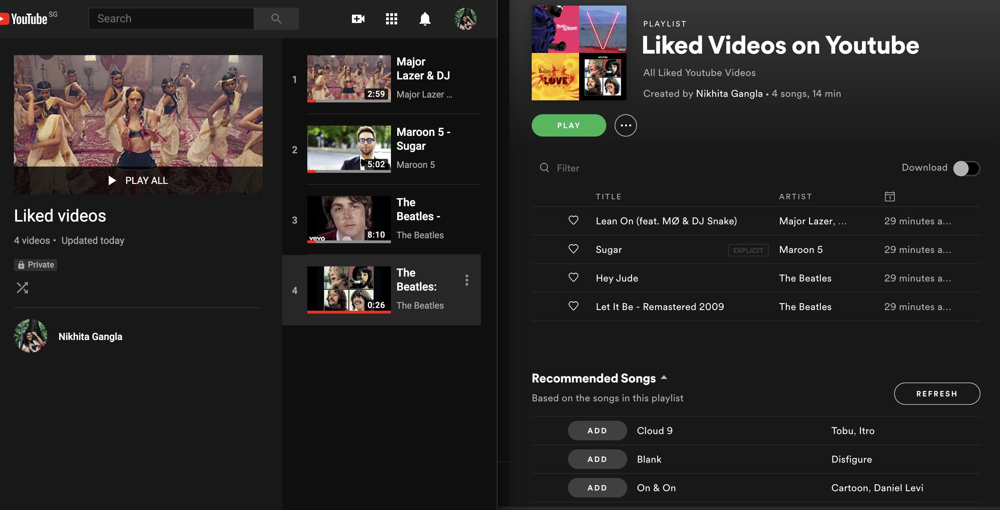

# An Automated Spotify Playlist from YouTube Liked Videos
This project uses a Python script in order to take Liked videos from my YouTube account, and automatically add them to a dedicated Playlist in my Spotify Account. 

